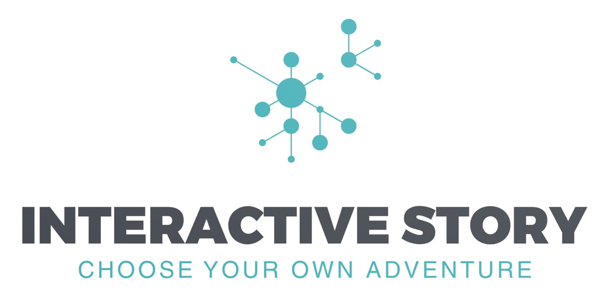

# Interactive Story

<a href="#"></a>

## Introduction

The **Interactive Story** is a web app developed as Software Engineering course's final project, adhering to core **Object-Oriented Programming (OOP)** principles, **SOLID** principles, and implementing various **design patterns** for scalability and maintainability. The game is an engaging platform where users can immerse themselves in interactive stories, make choices, and explore different outcomes.

This project is built with a focus on clean architecture, modularity, and a separation of concerns, ensuring a robust and extensible codebase.

## How the Game Works

The game offers players a dynamic storytelling experience:

1. **Interactive Story Selection**:
   Players can browse through a catalog of stories, each represented by a brief description and title.

2. **Gameplay Mechanics**:

   - Each story is broken down into scenarios.
   - Players make choices, answer riddles, or provide items to progress.
   - Based on the choices, the story branches into different paths.

3. **Dynamic Scenarios**:

   - Scenarios may include challenges such as riddles or specific item requirements.
   - The game adapts based on the player's inventory and responses.

4. **Endgame**:
   - Stories conclude when all scenarios are completed or when players reach specific final outcomes.

## How to Play

1. **Browse Stories**:

   - Visit the homepage to view available stories.
   - Click "Gioca ora" to start a story (login required).

2. **Make Choices**:

   - Follow the prompts, make decisions, and progress through the story.

3. **Endgame**:
   - Complete the story or explore multiple endings based on your choices.

## Technologies Used

The project integrates modern technologies for both frontend and backend:

### Frontend:

- **HTML5**, **CSS3**, and **JavaScript**: For responsive and interactive user interfaces.
- **Firebase Authentication**: User login and registration.
- **Dynamic Rendering**: Scenarios, choices, and outcomes are dynamically displayed based on backend responses.

### Backend:

- **Spring Boot**:
  - RESTful APIs to handle game logic and interactions.
  - Session management for user state tracking.
- **Firebase Firestore**:
  - Database for storing stories, scenarios, and user progress.
- **Java**:
  - Backend language adhering to OOP principles.
  - Controllers and services handle requests and game logic.

## Installation and Setup

### Prerequisites

- **Java JDK 17+**
- **Node.js** (for frontend dependencies if needed)
- **Maven** (for building the backend)
- **Firebase Project**: Set up Firebase Firestore and Authentication.

### Steps to Install

1. **Clone the Repository**:

   ```bash
   git clone https://github.com/ngljcb/InteractiveStory.git
   cd /app/InteractiveStory
   ```

2. **Initial Setup**:

   - Navigate to the `resources` folder:
     ```bash
     cd /src/main/resources/
     ```
   - Configure `google-services.json` for Firebase:
     ```properties
     {
        "type": "xxxxx",
        "project_id": "xxxxx",
        "private_key_id": "xxxxx",
        "private_key": "xxxxx",
        "client_email": "xxxxx",
        "client_id": "xxxxx",
        "auth_uri": "xxxxx",
        "token_uri": "xxxxx",
        "auth_provider_x509_cert_url": "xxxxx",
        "client_x509_cert_url": "xxxxx",
        "universe_domain": "xxxxx"
     }
     ```

3. **Build and run**:

   - Install dependencies (if applicable):
     ```bash
     mvn clean install
     ```
   - Run the app:
     ```bash
     mvn spring-boot:run
     ```

4. **Access the Game**:
   - Open your browser and navigate to `http://localhost:8080` for the game interface.

## License

This project is licensed under the MIT License. See the `LICENSE` file for details.
